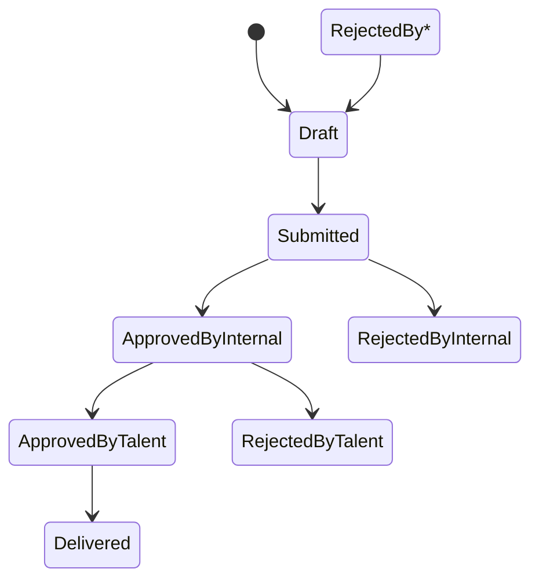

# 📝 Request Lifecycle

---

## State Descriptions & Transitions

| State                | Who Can Change Status      | Trigger/Action                        | Editable?           |
|----------------------|---------------------------|---------------------------------------|---------------------|
| **Draft**            | Brand User                | User saves or edits draft             | Yes                 |
| **Submitted**        | Brand User                | User submits request                  | No                  |
| **ApprovedByInternal** | Internal Reviewer        | Internal reviewer approves            | No                  |
| **RejectedByInternal** | Internal Reviewer        | Internal reviewer rejects             | No (returns to Draft) |
| **ApprovedByTalent** | Talent Team               | Talent team gives final approval      | No                  |
| **RejectedByTalent** | Talent Team               | Talent team rejects                   | No (returns to Draft) |
| **Delivered**        | Talent Team               | Talent delivers final asset           | No                  |

---

## Transition Details

- **Draft → Submitted**: Brand User submits the request for review. Request becomes locked for editing.
- **Submitted → ApprovedByInternal**: Internal Reviewer approves the request. Moves to Talent Team for final approval.
- **Submitted → RejectedByInternal**: Internal Reviewer rejects the request. Returns to Draft for user edits.
- **ApprovedByInternal → ApprovedByTalent**: Talent Team approves the request. Moves to delivery phase.
- **ApprovedByInternal → RejectedByTalent**: Talent Team rejects the request. Returns to Draft for user edits.
- **ApprovedByTalent → Delivered**: Talent Team delivers the final asset to the user.
- **RejectedBy* → Draft**: Any rejection (by Internal or Talent) returns the request to Draft, making it editable again by the Brand User.

---

## Editability

- **Editable**: Only in Draft state (and after rejection, when returned to Draft).
- **Locked**: After submission and during all review/approval/delivery stages.
