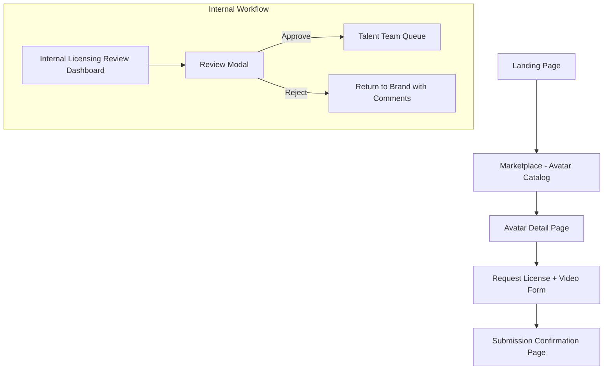

# 🧠 PonteAI AI Avatar Marketplace – UX/UI Execution Plan (Web Only)

## 🧩 Contextual Alignment with PonteAI

- **Brand Positioning**: PonteAI is a premium, licensed AI avatar marketplace focused on celebrities, creators, and enterprise use cases.
- **Dual Offerings**: Marketplace for AI avatars and a data brokerage offering.
- **Design Language**: Corporate, clean, minimalist, premium.

---

## 🌐 Global Design Principles

- **Personas**:
  - Primary: Brand Managers / Marketing Leads
  - Secondary: Internal Reviewers (Legal, Compliance)
  - Tertiary: Talent Agents

- **Design Heuristics**:
  - Visual hierarchy using elevation, color, and grouping
  - Progressive disclosure for approvals and complexity
  - Enterprise trust signals (badges, legal info, licensing tiers)

---

## 🧭 User Flow Summary

---

## 🏠 Landing Page

### Purpose:
Orient enterprise brands, communicate avatar licensing, and drive to marketplace.

### Layout:
- **Hero**: Headline, looped avatar videos, CTA
- **How it Works**: 4 steps (Browse → Submit → Review → Deliver)
- **Featured Avatars Carousel**
- **Trust Logos & Footer**

### CTA:
- Primary: “Browse Avatars”
- Secondary: “Explore Data Marketplace”

### Assets:
- 5–10 looped avatar preview .mp4s
- SVG icon set (browse, script, approve, deliver)
- PonteAI logo, branding elements

---

## 🧑‍🤝‍🧑 Avatar Catalog Page

### Features:
- Grid layout (3-4 across)
- Filters:
  - Tone, Gender, Language, Use Case
  - Industry (e.g., Fitness, Corporate)
  - Tier (Celebrity, Creator)

### Avatar Card Includes:
- Portrait with hover preview
- Name + tagline
- Badges (e.g. "Tier 1 Celebrity", "Verified License")
- “Request License” CTA

---

## 👤 Avatar Detail Page

### Layout:
- **Left**: Video carousel (demo, testimonials, promos)
- **Right**: Bio, tone, tags, CTA

### Additional Tabs:
- **Licensing Terms**
- **Brand Testimonials**
- **Suggested Avatars**

### Sidebar Metadata:
- Talent name, agent, tier
- Pricing/licensing structure
- Available tones, languages, and restrictions

---

## 📋 Request License + Video Form

### Fields:
- Prompt / Script (textarea)
- Tone (dropdown with visual tags)
- Use Case
- Attachments (optional)
- Usage Type: Marketing / Internal / Ads
- Deadline (optional)

### UX Features:
- 3-step form (Script → License → Review)
- Auto-save + inline validations
- Previews for each tone
- Tooltip for script guidance

---

## ✅ Submission Confirmation Page

- Step progress bar (Step 1 of 3 Complete)
- Confirmation message: “Review in Progress”
- Timeline graphic:
  - Brand Submitted
  - Licensing Review (in progress)
  - Talent Approval (pending)
- CTA:
  - “Track My Requests”
  - “Submit Another Request”

---

## 🛠️ Internal Licensing Review Dashboard

### Columns:
- Request ID
- Avatar
- Brand
- Tone
- License Tier
- Status
- Contract Sent?
- Action

### Modal:
- Script
- Usage intent
- Licensing auto-checklist
- Contract generation + e-sign trigger
- Approve / Reject with feedback

---

## 👥 Talent Team Approval Queue

### Columns:
- Avatar
- Usage Info
- Brand
- Approved License?
- Notes from PonteAI
- Scheduling

### Features:
- “Ready to Generate” button
- Inline clarification thread
- Talent availability tagging

---

## 📦 Component Inventory

| Component              | Purpose                                  |
|------------------------|------------------------------------------|
| `AvatarLicenseCard`    | Avatar summary with license tags         |
| `RequestLicenseForm`   | 3-step wizard for license & script       |
| `ReviewTableRow`       | Legal queue row                          |
| `ApprovalModal`        | Licensing + contract + feedback modal    |
| `TimelineStatusBlock`  | Submission progress visual               |
| `ToneTag`              | Visual chips with hover info             |
| `ChatThreadWidget`     | Clarifications between teams             |

---

## 🎨 Visual Design Tokens

- **Primary**: Dark Blue `#003366`
- **Accent**: Teal `#00B3A4`
- **Backgrounds**: Light Gray `#F9F9FB`
- **Typography**: Inter, 16px base, 28px headers
- **Elevations**: Cards with soft drop shadows for grouping

---

## 🧪 UX Research Plan

- **Pilot Usability Test**:
  - 5–8 brand managers
  - Task: find avatar → submit request → track status
- **Internal Legal Interviews**:
  - Contract clarity and review speed
  - Feedback on rejection UX
- **Talent Agent Interviews**:
  - Talent availability flow
  - Feedback loop clarity

---

## 🔜 Next Steps

1. [ ] Finalize high-fidelity wireframes in Figma  
2. [ ] Build component structure in React (Next.js + Tailwind)  
3. [ ] Script stakeholder onboarding walkthrough demo  
4. [ ] Validate MVP with pilot users before full launch
